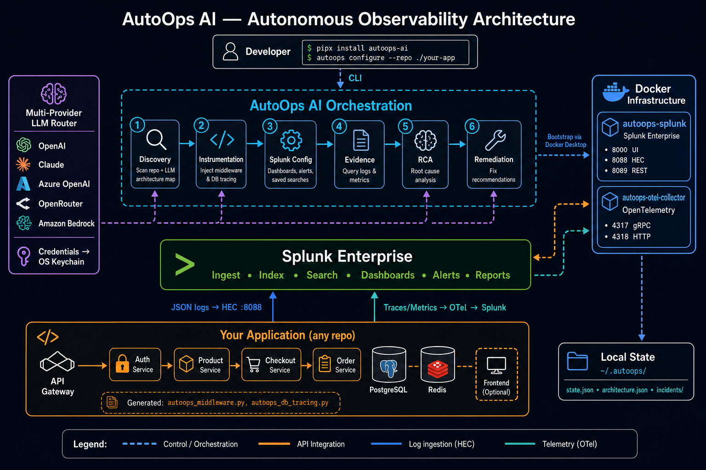
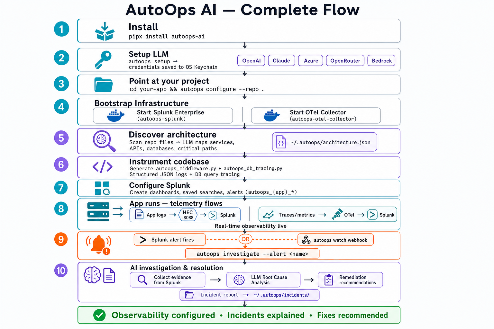

# AutoOps AI

[](https://pypi.org/project/autoops-ai/)
[](https://www.python.org/downloads/)
[](LICENSE)

**Configure observability and investigate incidents for any codebase with Splunk and AI.**

AutoOps AI is an autonomous observability engineer. Install it, connect an LLM provider, point it at any repository, and it scans your architecture, generates instrumentation, bootstraps Splunk and OpenTelemetry in Docker, creates dashboards and alerts, and runs AI-driven incident investigations with root cause analysis and remediation recommendations.

**Repository:** https://github.com/kenzzhood/AutoOps  
**PyPI:** https://pypi.org/project/autoops-ai/

---

## Table of Contents

- [Architecture](#architecture)
- [Features](#features)
- [Prerequisites & Dependencies](#prerequisites--dependencies)
- [Install](#install)
- [Quick Start](#quick-start)
- [How It Works](#how-it-works)
- [Command Reference](#command-reference)
- [Configuration](#configuration)
- [Example Apps & Validation](#example-apps--validation)
- [Development](#development)
- [Built With](#built-with)
- [License](#license)

---

## Architecture

Required submission diagram: [`architecture_diagram.png`](architecture_diagram.png)  
Detailed write-up: [`architecture_diagram.md`](architecture_diagram.md)



## Complete Flow



---

## Features

- **Multi-provider LLM** — OpenAI, Claude, Azure OpenAI, OpenRouter, Amazon Bedrock
- **Configure pipeline** — `autoops configure --repo .` bootstraps the full observability stack
- **Splunk bootstrap** — Auto-starts Splunk Enterprise in Docker (`autoops-splunk`)
- **OpenTelemetry collector** — Traces, metrics, and logs pipeline (`autoops-otel-collector`)
- **Architecture discovery** — LLM scans your repo and maps services, APIs, databases
- **Auto-instrumentation** — Generates `autoops_middleware.py` and `autoops_db_tracing.py`
- **Splunk artifacts** — Dashboards, saved searches, and alerts out of the box
- **AI incident pipeline** — Evidence collection → RCA → Remediation with incident reports

---

## Prerequisites & Dependencies

### System requirements

| Requirement | Version | Purpose |
|-------------|---------|---------|
| Python | 3.11+ | CLI and agents |
| Docker Desktop | Latest | Splunk + OTel containers |
| LLM API key | Any supported provider | Architecture discovery and RCA |

### Python dependencies

Declared in [`pyproject.toml`](pyproject.toml):

```
anthropic, boto3, httpx, jinja2, keyring, mcp, openai,
pydantic, python-dotenv, questionary, requests, rich, typer
```

Dev dependencies: `pytest`, `pytest-asyncio`, `pytest-mock`

### Install dependencies

```bash
# End users (PyPI)
pipx install autoops-ai

# Contributors (from source)
pip install -e ".[dev]"
```

### Example configuration

Copy the example env file — **never commit real keys**:

```bash
cp .env.example .env
```

See [`.env.example`](.env.example) for all supported environment variables.

---

## Install

### From PyPI (recommended)

```bash
pipx install autoops-ai
# or
pip install autoops-ai
```

### From source

```bash
git clone https://github.com/kenzzhood/AutoOps.git
cd AutoOps
pip install -e ".[dev]"
```

### Install scripts

```bash
# macOS / Linux
curl -fsSL https://raw.githubusercontent.com/kenzzhood/AutoOps/main/scripts/install.sh | bash

# Windows PowerShell
pip install autoops-ai
# or run scripts/install.ps1 from the repo
```

---

## Quick Start

```bash
# 1. Connect your AI provider (credentials saved to OS keychain)
autoops setup

# 2. Configure observability for any project
cd /path/to/your/app
autoops configure --repo .

# 3. Verify the stack
autoops doctor
autoops telemetry test

# 4. Investigate when an alert fires
autoops investigate --alert autoops_your-app_checkout_error_rate --window 30m
```

---

## How It Works

When you run `autoops configure --repo .`, AutoOps executes six phases automatically:

| Phase | What happens |
|-------|----------------|
| **Discovery** | Scans repo files; LLM maps services, APIs, databases, critical paths → `~/.autoops/architecture.json` |
| **Instrumentation** | Generates middleware and DB tracing in your codebase |
| **Splunk Config** | Creates dashboards, saved searches, alerts (`autoops_{app}_*`) |
| **Evidence** | Queries Splunk logs and metrics during investigation |
| **RCA** | LLM analyzes evidence and identifies root causes |
| **Remediation** | LLM recommends fixes; saves incident report to `~/.autoops/incidents/` |

Infrastructure bootstrapped in Docker:

| Container | Ports | Role |
|-----------|-------|------|
| `autoops-splunk` | 8000 UI, 8088 HEC, 8089 REST | Log storage, dashboards, alerts |
| `autoops-otel-collector` | 4317 gRPC, 4318 HTTP | Traces/metrics → Splunk HEC |

Telemetry flows from your app to Splunk via **HEC (JSON logs)** and **OpenTelemetry**.

Full integration guide: [docs/ARCHITECTURE.md](docs/ARCHITECTURE.md)

---

## Command Reference

| Command | Description |
|---------|-------------|
| `autoops setup` | Interactive LLM provider setup |
| `autoops configure --repo .` | Full project observability setup |
| `autoops doctor` | Health check (Docker, Splunk, HEC, ports, LLM) |
| `autoops provider list\|set\|test\|show` | Manage LLM profiles |
| `autoops splunk start\|status\|stop\|logs\|open` | Manage Splunk container |
| `autoops telemetry start\|status\|test` | Manage OTel Collector |
| `autoops dashboards apply\|list\|open` | Splunk dashboards |
| `autoops alerts apply\|list\|test` | Splunk alerts |
| `autoops scan --repo .` | Scan repo file tree |
| `autoops instrument --repo .` | Generate instrumentation only |
| `autoops investigate --alert <name>` | Run incident investigation |
| `autoops watch --port 9000` | Webhook listener for Splunk alerts |
| `autoops demo start\|bug-on\|traffic` | Local demo workflow |

`autoops init --repo <path>` is an alias for `configure`.

---

## Configuration

### Environment variables

Copy `.env.example` to `.env` for optional env-var fallbacks when keyring is unavailable:

```bash
cp .env.example .env
# Edit .env with your provider keys (never commit .env)
```

### Local state (`~/.autoops/`)

| File | Contents |
|------|----------|
| `state.json` | Splunk credentials, HEC token, dashboard/alert names |
| `architecture.json` | Discovered services, endpoints, critical paths |
| `incidents/` | Investigation reports (evidence + RCA + remediation) |
| `config.json` | LLM profile metadata (keys in keychain) |

### Splunk defaults created

**Dashboards:** Service Health Overview, Database Performance, Deployment Timeline, Incident Investigation, per-service health

**Saved searches:** error rate, latency, p95 latency, DB latency, deployments, no-data detection

**Alerts:** per-service error rate, checkout error rate, 5xx spike, ingestion stopped

**Sample SPL:**

```spl
index=main sourcetype=autoops | stats count by service, path, level
index=main sourcetype=autoops path="/checkout" | timechart avg(duration_ms) p95(duration_ms)
```

### LLM providers

OpenAI · Claude (Anthropic) · Azure OpenAI · OpenRouter · Amazon Bedrock

Credentials are stored in your OS keychain, not in plain text.

---

## Example Apps & Validation

### Demo app (simple FastAPI)

Location: [`demo-app/`](demo-app/)

```bash
autoops demo start
cd demo-app && uvicorn main:app --port 8080
autoops demo bug-on
autoops demo traffic --requests 30
autoops investigate --alert checkout_error_rate
```

### ShopVerse validation suite (microservices)

Location: [`validation/shopverse-platform/`](validation/shopverse-platform/)

7 microservices, PostgreSQL, Redis, injectable incident types, Docker Compose.

```bash
bash validation/reset_fresh.sh          # optional fresh start
pip install -e .
python3 scripts/seed_provider_from_env.py
cd validation/shopverse-platform && docker compose up -d --build
autoops configure --repo validation/shopverse-platform
python3 validation/run_validation.py
```

See [validation/README.md](validation/README.md) and [validation/validation_report.md](validation/validation_report.md).

### Example architecture fixture

[`tests/fixtures/sample_architecture.json`](tests/fixtures/sample_architecture.json) — sample discovered architecture for tests.

---

## Development

```bash
git clone https://github.com/kenzzhood/AutoOps.git
cd AutoOps
pip install -e ".[dev]"
pytest
```

See [CONTRIBUTING.md](CONTRIBUTING.md) for the full contribution guide.

---

## Built With

Python · Splunk Enterprise · OpenTelemetry · Docker · FastAPI · PostgreSQL · Redis · Typer · Pydantic · LLMs (OpenAI, Claude, Azure OpenAI, OpenRouter, Bedrock)

Full list: [docs/BUILT_WITH.md](docs/BUILT_WITH.md)

---

## License

MIT — see [LICENSE](LICENSE)
